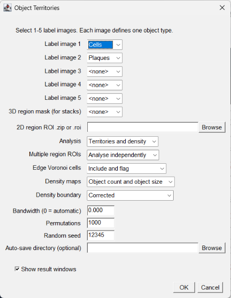

# Object Territories

[](https://github.com/Jay2owe/ObjectTerritories/actions/workflows/build.yml)
[](LICENSE)

**A Fiji/ImageJ plugin that turns labelled objects in 2D images or 3D stacks
into region-bounded Voronoi territories, permutation-tested neighbourhood
interactions between object types, and kernel density maps.**

Give it one label image per object type (for example cells and plaques) and a
region (an ImageJ ROI in 2D, a labelled mask stack in 3D). Each object gets a
territory: the part of the region closer to it than to any other object. From
those territories the plugin reports each object's area or volume and its
neighbours, tests whether object types border each other more or less often
than chance, and draws calibrated density maps of where each type
concentrates. If you use Object Territories in your research, please cite it
(see [Citing](#citing)).

- 1-5 matching 2D label images or 3D label stacks, each one object type.
- 2D regions from ImageJ `.roi` files or ROI `.zip` sets, analysed
  independently or as one union; Voronoi cells are clipped to arbitrary region
  shapes and cells touching the boundary are flagged.
- Genuine 3D territories assigned voxel by voxel with calibrated x/y/z
  distances (anisotropic z-spacing included); two territories are neighbours
  when their voxels share a face.
- Per-object territory area or volume, neighbour count and neighbour
  identities.
- Observed, expected, z-score and two-sided permutation p-value interaction
  matrices, reproducible from a seed.
- Territory-size coefficient of variation and mean nearest-neighbour
  distance and SD.
- Gaussian kernel density maps (corrected or clipped at the region boundary),
  weighted by object count, object size, or both, plus leave-one-out local
  density for every object.
- Interactive dialog, recordable macros, headless runs, 2D and 3D folder
  batches with a saved manifest, and a public Java API.

## Install from the Fiji update site

The update site is planned and not yet live. Once it is, in Fiji choose
**Help > Update... > Manage update sites**, add a site named
`ObjectTerritories` with this URL, enable it, apply the changes and restart
Fiji:

`https://sites.imagej.net/ObjectTerritories/`

Until then, install the jar by hand:

1. Close Fiji.
2. Download `Object_Territories-<version>.jar` from the latest
   [GitHub release](https://github.com/Jay2owe/ObjectTerritories/releases).
3. Put it in `Fiji.app/plugins/`, removing any older `Object_Territories-*.jar`.
4. Restart Fiji.

The commands appear at:

```text
Plugins > Object Territories
Plugins > Object Territories Batch...
```

JTS (Java Topology Suite) and the plugin's own engine are bundled inside the
jar under private package names. Install only the Object Territories jar; do
not copy JTS or any `territories-core` / `oc3d-core` jar into Fiji.

## Requirements

- Fiji with ImageJ 1.54p or later (the version current Fiji ships).
- Java 8 or newer (Fiji's bundled Java is fine).
- Label images: 8-, 16- or 32-bit, background 0, objects as positive integer
  labels. RGB images are rejected because their pixel values are packed
  colours, not labels. All label images in one run must have the same size.
- For 3D: a region-mask stack of the same size whose positive integer values
  name the regions.

Spatial calibration is read from the images; uncalibrated images are
analysed in pixels and a warning is logged.

## Interactive use

Open the label images (and, for 3D, the region-mask stack), then run
**Plugins > Object Territories**.

<p align="center">
  
</p>

- **Label image 1-5**: one open image per object type. Leave the rest at
  `<none>`.
- **3D region mask**: for label stacks, the open positive-integer mask stack.
- **2D region ROI**: for 2D label images, a `.roi` file or ROI `.zip` set.
- **Analysis**: territories and density, territories only, or density only.
- **Multiple region ROIs**: analyse each named ROI (or mask label)
  independently, or combine them into one union.
- **Edge Voronoi cells**: include boundary-touching cells and flag them, or
  exclude them from the summary statistics.
- **Density maps / Density boundary / Bandwidth**: see
  [How it works](#how-it-works); bandwidth 0 chooses it automatically.
- **Permutations / Random seed**: size and seed of the interaction null model.
- **Auto-save directory**: optional; writes the files listed under
  [Saved output](#saved-output).

Progress is shown in Fiji's status bar. Press Escape to stop a run; it stops
within a second, even part-way through a density map or a 3D territory
assignment, and nothing partial is shown or saved.

## Folder batch

**Plugins > Object Territories Batch...** runs the analysis over a folder of
label images, grouping files into samples with a filename regular
expression. Select the capture group that holds the label type; the other
captures identify the sample. With the default pattern
`(?i)(.+)_([^_]+)\.(?:tif|tiff)$` and capture group 2, `sample01_A.tif` and
`sample01_B.tif` form one two-type sample.

The preview lists every discovered file and the planned outcome before
anything runs; **Back** returns to the settings. Tick **Recursive** to search
subfolders. Discovery is deterministic, avoids directory cycles and skips
the output folder, so a later run cannot consume its own results. Groups of
one to five label types run; larger groups are skipped. Each sample is written
to its own folder, and every outcome (processed, skipped, error or
cancelled, with the reason) is recorded in `Batch_Manifest.csv` in the output
folder, including runs in which some groups failed or the run was stopped.

**2D** (`dimensions=2D`, the default): one `.roi` or ROI `.zip` region set is
applied to every sample.

**3D** (`dimensions=3D`): each sample carries its own region-mask stack. The
file whose label-type capture equals `region_mask_type` (default `mask`,
compared case-insensitively) is the mask; the other one to five files are
label stacks. For example `brain1_Cells.tif`, `brain1_Plaques.tif` and
`brain1_mask.tif` form one two-type 3D sample. A sample with no mask file, or
more than one, is recorded as an error; the five-type limit does not count
the mask. The region ROI field is ignored in 3D.

## Macro use

A 2D run that saves its results without opening windows:

```ijm
run("Object Territories",
    "mode=both label1=[A.tif] label2=[B.tif] regions=[C:/data/region.roi] " +
    "region_mode=independent edge_cells=include_flagged density_weighting=both " +
    "boundary=corrected bandwidth=auto permutations=1000 seed=12345 " +
    "output=[C:/results/sample-01] hide_results");
```

A genuine 3D run with an open region-mask stack:

```ijm
run("Object Territories",
    "mode=both label1=[cells3d.tif] label2=[plaques3d.tif] region_mask=[mask3d.tif] " +
    "region_mode=independent edge_cells=include_flagged density_weighting=both " +
    "boundary=corrected bandwidth=auto permutations=1000 seed=12345 " +
    "output=[C:/results/sample-01-3D] hide_results");
```

| Option | Values | Default |
|---|---|---|
| `mode` | `territories`, `density`, `both` | `both` |
| `label1`...`label5` | titles of open label images | `label1` required |
| `regions` | ImageJ `.roi` or ROI `.zip` path for 2D | one region input required |
| `region_mask` | title of an open positive-integer 3D mask stack | one region input required |
| `region_mode` | `independent`, `union` | `independent` |
| `edge_cells` | `include_flagged`, `exclude_from_summaries` | `include_flagged` |
| `density_weighting` | `object_count`, `object_size`, `both` | `both` |
| `boundary` | `corrected`, `clipped` | `corrected` |
| `bandwidth` | positive physical distance or `auto` | `auto` |
| `permutations` | 1 to 1,000,000 | `1000` |
| `seed` | integer | `12345` |
| `output` | auto-save directory | none |
| `hide_results` | suppress result windows | off |

Supply exactly one of `regions` or `region_mask`. Headless runs need
`output=[directory]`. Image titles and paths must not contain `[`, `]` or
quotes, which ImageJ macros cannot record. A failed headless run logs one
`[Object Territories] ERROR: <message>` line and stops the macro.

Folder batches, 2D and 3D (add `recursive` to search subfolders):

```ijm
run("Object Territories Batch...",
    "input_folder=[C:/data/labels] filename_regex=[(?i)(.+)_([^_]+)\\.(?:tif|tiff)$] " +
    "label_type_capture_group=2 dimensions=2D region_mask_type=mask " +
    "region_roi_file_or_zip=[C:/data/region.roi] analysis=BOTH " +
    "multiple_region_rois=INDEPENDENT edge_cells=INCLUDE_FLAGGED " +
    "density_weighting=BOTH density_boundary=CORRECTED bandwidth_0_is_automatic=0 " +
    "permutations=1000 random_seed=12345 output_directory=[C:/results/batch-2D]");

run("Object Territories Batch...",
    "input_folder=[C:/data/stacks] filename_regex=[(.+)_([^_]+)\\.tif] " +
    "label_type_capture_group=2 dimensions=3D region_mask_type=mask " +
    "region_roi_file_or_zip=[] analysis=BOTH " +
    "multiple_region_rois=INDEPENDENT edge_cells=INCLUDE_FLAGGED " +
    "density_weighting=BOTH density_boundary=CORRECTED bandwidth_0_is_automatic=0 " +
    "permutations=1000 random_seed=12345 output_directory=[C:/results/batch-3D]");
```

Macros recorded before 3D batch existed omit `dimensions` and still run as 2D.
Use ImageJ's Macro Recorder while running either command to capture its
complete replayable options. A run that fails, or a single run stopped with
Escape, leaves no line behind; a batch stopped with Escape is still recorded,
since it saved its finished samples and manifest.

## Java API

```java
ObjectTerritoriesParameters parameters = ObjectTerritoriesParameters.builder()
    .addLabelImage(labelsA)
    .addLabelImage(labelsB)
    .regions(regionRois)
    .analysisMode(AnalysisMode.BOTH)
    .densityWeightingSelection(DensityWeightingSelection.BOTH)
    .permutations(1000)
    .seed(12345L)
    .build();

ObjectTerritoriesResult result = ObjectTerritories.analyze(parameters);
try {
    // Read region results, tables, geometries, and density images.
} finally {
    result.closeDensityImages();
}
```

The Java API does not show windows, write files, mutate input images, or use
ImageJ's global Results table. The caller owns returned density images.

For 3D, use `ObjectTerritoriesParameters3D` and
`ObjectTerritories.analyze3D(...)`; the matching positive-integer mask stack
defines independent labelled volumes or their union. Both methods have an
overload taking a `territories.api.ProgressMonitor` for progress and
cancellation.

Folder batches are available through
`territories.batch.ObjectTerritoriesBatchParameters` (`builder(...)` for 2D,
`builder3D(...)` for 3D), `ObjectTerritoriesBatchRunner.preview(...)` and
`ObjectTerritoriesBatchRunner.run(...)`.

## Saved output

```text
<output>/
  Objects/<region>_Objects.csv                        per-object measurements
  Interactions/<region>_Interactions.csv              observed, expected, z, p per type pair
  Interactions/<region>_Regularity.csv                size CV, nearest-neighbour mean and SD
  Density/<region>_<type>_<weighting>_bw-<bandwidth>.tif   32-bit density map
  Maps/<region>_Territories.tif                       territory map
```

3D runs write the same folders with `_3D` names:
`<region>_Objects_3D.csv`, `<region>_Interactions_3D.csv`,
`<region>_Regularity_3D.csv`, `..._bw-<bandwidth>_Density_3D.tif` and a
`<region>_Territories_3D.tif` stack whose voxel value is the owning object's
index plus one (0 outside the region).

A folder batch writes `Batch_Manifest.csv` (columns `Folder`, `Group`,
`Dimensions`, `Status`, `Label_Types`, `Output`, `Message`) in the output
folder and one such tree per sample.

## How it works

**Territories in 2D.** Object centroids are computed in calibrated units from
the label images. The plugin builds the exact Voronoi tessellation of the
centroids with JTS and clips every cell to the region polygon, so each
territory is the part of the region closer to its object than to any other.
Two objects are neighbours when they are joined in the Delaunay triangulation
and their clipped cells still share a border inside the region. Cells that
touch the region boundary are flagged, and can be left out of the summary
statistics, because their size is truncated by the boundary rather than by
their neighbours.

**Territories in 3D.** Every voxel inside the region mask is assigned to the
nearest object centroid using calibrated x, y and z distances (a k-d tree
answers the queries; ties go to the lower object index). Assignment respects
the mask's connected components: a voxel can only belong to an object in the
same piece of the region. Two territories are neighbours when their voxels
share a face (6-connectivity). The result is volumetric, not a projection,
and like any voxel analysis its precision follows the image resolution.

**Interactions.** For each pair of object types the plugin counts neighbour
contacts, then repeats the count after randomly shuffling the type labels
over the same territories (1000 permutations by default, from a fixed seed).
The expected count is the mean over permutations, the z-score is the
observed minus expected count divided by the permutation SD, and the
two-sided p-value is (k + 1) / (n + 1), where k counts permutations at least
as far from the expected value as the observed count and n is the number of
permutations.

**Density maps.** Each object contributes a Gaussian kernel, truncated at
three standard deviations and weighted by 1 (object count) or by its area or
volume (object size). The automatic bandwidth is a Scott-type rule: the mean
of the per-axis standard deviations of the centroids times n^(-1/6) in 2D or
n^(-1/7) in 3D, never below the pixel or voxel size. Kernels only spread
within the region component that holds their object. With the **corrected**
boundary each kernel is renormalised over the part of it that falls inside
the region, so every object contributes its full weight however close it
lies to the edge; with **clipped** the textbook normalisation is kept and
weight near the edge is lost. Pixels outside the region are NaN.

**Local density.** For every object the plugin also reports the density at
its own centroid from all other objects of its type (leave-one-out), a
per-object measure of how crowded its surroundings are that does not count
the object itself.

## Parallel execution

Density maps, 3D territory assignment and the interaction permutations run
on a bounded pool of worker threads. Results are bit-identical to a serial
run: each density pixel receives its kernel contributions in the same order,
and permutations keep the original seeded shuffle sequence and result order.
The automatic limit is eight workers. Set the JVM system property
`territories.parallelism` to a positive integer to override it, or to `1` to
use the serial reference path.

On a 16-thread workstation, a 1024 x 1024 image with 2 x 1000 objects and
automatic-bandwidth density maps takes about 9 s instead of 48 s, and a
384 x 384 x 64 stack with 2 x 800 objects about 48 s instead of 217 s.

## Building from source

The plugin depends on two private engine modules,
`io.github.jay2owe:oc3d-core:0.1.0` and
`io.github.jay2owe:territories-core:0.2.1`, which are not on a public Maven
repository. Install both into the same local repository first:

```text
git clone --branch v0.1.0 https://github.com/Jay2owe/oc3d-core.git ../oc3d-core
git clone --branch v0.2.1 https://github.com/Jay2owe/territories-core.git ../territories-core
./mvnw -f ../oc3d-core/pom.xml clean install
./mvnw -f ../territories-core/pom.xml clean install
./mvnw clean verify
```

The built jar is `target/Object_Territories-<version>.jar`. The project
targets Java 8 bytecode for Fiji compatibility; the Maven wrapper downloads
its own Maven. `verify` opens the packaged plugin through an isolated class
loader to prove that the private cores and JTS are present, that no
unrelocated copy of any of them survives, and that ImageJ itself is not
bundled.

**Equivalence gate.** `src/test/java/territories/equivalence/` re-runs the
whole documented option space and compares every field against goldens
captured before the engine was extracted, held in `golden/pre-extraction/`.
Those goldens are **immutable**: a golden later found to be wrong is a bug
report against the shipped plugin, to be fixed as its own change with its own
release note, never by regenerating them to make a difference disappear.
Everything in the gate is compared as raw IEEE-754 bit patterns with no
tolerance, floating-point territory areas included.

```text
./mvnw -o test -Dtest=GoldenEquivalenceTest                        # verify
./mvnw -o test -Dterritories.golden.dump=<case-name>               # print one case
```

`scripts/fiji-smoke/` holds a headless smoke test that installs the built jar
into a throwaway Fiji and runs both commands end to end.

## Citing

If you use Object Territories in published work, please cite the release you
used. The exact reference for your reference manager is in
[`CITATION.cff`](CITATION.cff), or use **Cite this repository** on the
GitHub page.

The analysis engine is embedded from `territories-core`, a component of this
plugin; citing Object Territories covers it. The 2D geometry uses
[JTS](https://github.com/locationtech/jts).

## Acknowledgements

Developed by Jamie Malcolm in the [Brancaccio Lab](https://www.ukdri.ac.uk/labs/brancaccio-lab)
at the [UK Dementia Research Institute](https://ukdri.ac.uk/centres/imperial),
Imperial College London.

This work was supported by the UK Dementia Research Institute,
which receives its core funding from the UK Medical Research Council,
the Alzheimer's Society, and Alzheimer's Research UK.

Built on the [Fiji](https://fiji.sc/) / [ImageJ](https://imagej.net/)
ecosystem; we thank the SciJava community for the platform.

## Licence

BSD 3-Clause; see [`LICENSE`](LICENSE). Attribution and third-party notices
are in [`NOTICE`](NOTICE); both ship inside the jar under `META-INF/`.

JTS is bundled and relocated, so the jar carries JTS bytecode. JTS is
dual-licensed EPL 2.0 / EDL 1.0; this plugin takes it under EDL 1.0 (BSD
3-Clause in substance) and ships the combined jar under BSD 3-Clause with the
JTS notice retained at `src/main/resources/META-INF/licenses/JTS-LICENSE.txt`.
Nothing on any code path links GPL.
